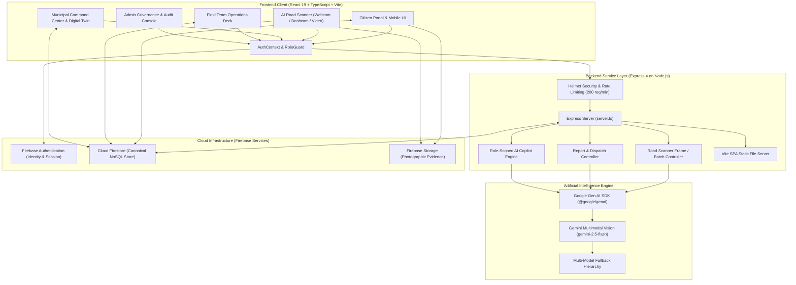
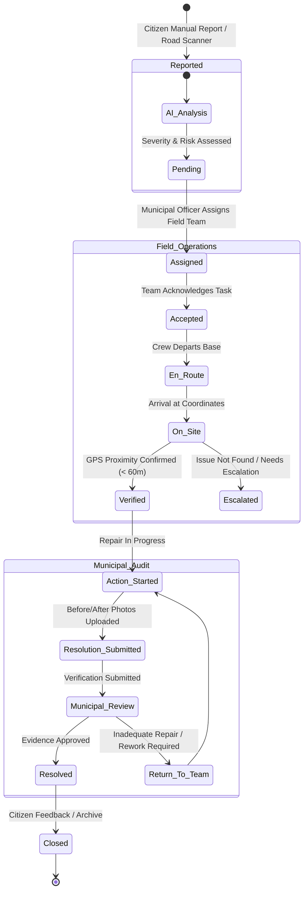

# UrbanPulse Guardian AI

> **An AI-powered civic infrastructure intelligence and sovereign urban safety platform connecting citizens, automated road vision telemetry, municipal command centers, and field response operations.**

[](#current-status)
[](#technology-stack)
[](#firebase--firestore)
[](#ai-road-scanner)
[](#technology-stack)

---

## 1. Executive Summary

Municipal infrastructure maintenance in rapidly expanding urban centers faces structural inefficiencies: road hazards go unrecorded until major vehicle damage or accidents occur, citizen complaints get lost in bureaucratic siloes, and municipal field crews lack verifiable triage evidence.

**UrbanPulse Guardian AI** closes this gap with a closed-loop urban intelligence lifecycle:
- **Citizens** report hazards manually or stream road telemetry while driving.
- **Multimodal AI Vision** detects road cavities, cracks, and safety hazards with bounding boxes and severity scoring.
- **Spatial Deduplication Engines** cluster adjacent sightings within a 5-meter Haversine radius to eliminate redundant tickets.
- **Municipal Command Centers** triage reports, evaluate SLAs, and dispatch specialized field response units.
- **Field Teams** navigate to incidents, execute GPS proximity verification, log repair actions, and submit before/after evidence.
- **Officers** review field evidence, approve resolutions, and automatically notify citizens in real time.

---

## 2. Problem Statement

Modern urban governance struggles with fragmented infrastructure monitoring:

1. **Hazard Proliferation**: Potholes, open manholes, surface fissures, and broken streetlights compromise commuter safety and vehicle longevity.
2. **Delayed Manual Reporting**: Traditional municipal grievance portals rely entirely on manual citizen submissions, creating reporting delays of days or weeks.
3. **Report Redundancy**: Multiple citizens file separate complaints for the same road crater, clogging municipal triage pipelines with duplicates.
4. **Lack of Objective Field Verification**: Municipal officers have no automated mechanism to verify whether a dispatched team reached the exact physical coordinates or if the hazard genuinely existed.
5. **No Evidence Trail for Work Orders**: Repairs are frequently closed without verifiable photographic proof, creating accountability gaps.
6. **Siloed Operational Telemetry**: Dispatches, citizen grievances, GIS hazard density, and municipal budgets operate across disconnected spreadsheets and legacy software.

---

## 3. The UrbanPulse Solution

UrbanPulse provides an end-to-end, multi-actor civic intelligence system:

```
  ┌────────────────────────────────────────────────────────────────────────┐
  │                           URBANPULSE LIFECYCLE                         │
  └────────────────────────────────────────────────────────────────────────┘

    [Citizen Input / Dashcam Video]
                   │
                   ▼
    [AI Road Scanner / Gemini Vision] ───► [5m Spatial Clustering & Deduplication]
                   │
                   ▼
    [Canonical Firestore Report Ticket]
                   │
                   ▼
    [Municipal Command Center Triage] ───► [Priority & SLA Deadline Assignment]
                   │
                   ▼
    [Field Team Operations Deck]      ───► [GPS Proximity Verification (< 60m)]
                   │
                   ▼
    [Repair Action & Photo Evidence]  ───► [Before / After Submission]
                   │
                   ▼
    [Municipal Officer Review]        ───► [Resolution Approval / Return for Rework]
                   │
                   ▼
    [Citizen Real-Time Notification & Civic Karma Reward]
```

---

## 4. Key Features

### Citizen Capabilities
- **Direct Incident Reporting**: Capture or upload photos with location tagging, category selection, and instant AI severity assessment.
- **AI Road Scanner**: Turn any smartphone camera, vehicle dashcam, or recorded driving video into an automated hazard detection sensor.
- **Safe Route Navigator**: Calculate commuter navigation routes scored dynamically by real-time proximity to active hazards along the transit corridor.
- **Citizen Safety Copilot**: Conversational AI assistant grounded exclusively in real-time localized hazard data to answer personal ticket status and safety queries.
- **Emergency SOS Broadcast**: Immediate priority alert trigger for life-threatening civic infrastructure failures.
- **Civic Rewards & Karma Leaderboard**: Earn civic engagement points for verified reports and redeem partner vouchers.

### Municipal Operations
- **City Command Center**: Filterable triage desk displaying active backlogs, high-severity clusters, and priority breakdowns.
- **Field Dispatch Management**: Real-time team allocation engine tracking team availability, active work orders, and category specializations.
- **SLA Deadline Tracking**: Automated deadline computation based on hazard severity and priority tier (Critical: 12h, High: 24h, Medium: 48h, Low: 72h).
- **Interactive GIS Map & Density Heatmap**: Leaflet-powered GIS viewer with marker clustering (`leaflet.markercluster`) and severity-weighted density heatmaps.
- **Smart City Digital Twin**: 5-layer interactive holographic vector map (Infrastructure, Traffic, Environmental, Safety, Composite Risk) computed from live incident telemetry.
- **Municipal AI Operations Advisor**: Director-level conversational assistant analyzing live operational metrics and offering data-grounded intervention strategies.
- **Executive Analytics & Ward Diagnostics**: Dynamic metrics tracking resolution velocity, hazard distribution, and ward-by-ward infrastructure health rankings.

### Field Team Operations
- **Field Operations Deck**: Dedicated task execution deck displaying assigned tickets, dispatch status, and route navigation.
- **GPS Proximity Verification**: Automated distance calculation confirming that the field team is physically on-site before permitting work order initiation.
- **Evidence Management**: Strict before-and-after photographic evidence capture uploaded to dedicated storage paths.
- **Repair Logging**: Action classification, material tracking, and notes documentation.
- **Unsafe Condition Escalation**: In-field hazard escalation for situations requiring specialized equipment or utility shutoffs.

### Platform Administration
- **User Role Management**: Role-based access governance (`citizen`, `municipal`, `field_team`, `admin`) with active status toggle.
- **Field Team Directory**: Management of response crews, team leads, department links, and availability states.
- **System Telemetry**: Monitoring of Firebase connection health, API latency, and error states.
- **Immutable Audit Ledger**: Tamper-proof activity logs recording state transitions and operator attributions.

---

## 5. System Architecture

The application is structured as a client-centric single-page application supported by a secure Node.js/Express service layer, Firebase Cloud services, and Google Gemini AI multimodal vision:



---

## 6. AI Road Scanner

> **Implementation Note**: The current production implementation uses **Google Gemini Multimodal AI Vision** (`gemini-2.5-flash` with resilient fallbacks). The project does not currently employ a standalone local YOLO/custom weights file; all computer vision and scene understanding is performed through the Gemini multimodal pipeline.

### Optical & Stream Input Sources
1. **Vehicle Dashcam (Hardware / Network)**:
   - Direct USB / UVC webcam hardware connection via `navigator.mediaDevices.getUserMedia`.
   - Network IP Dashcam streaming via MJPEG over HTTP (e.g., `http://192.168.1.254:8080/mjpeg`).
2. **Smartphone Camera**:
   - Mobile browser camera capture using rear-facing environment lens with continuous autofocus.
3. **Recorded Video File**:
   - MP4 / WebM dashcam video upload processed frame-by-frame through HTML5 Canvas extraction.

### Frame Sampling & Telemetry Pipeline
1. **Canvas Frame Extraction**: Video streams are sampled through an offscreen HTML5 `<canvas>` element at adaptive frame intervals, capturing base64 image frames alongside precise browser microsecond timestamps.
2. **GPS Synchronization**: Telemetry coordinates from `navigator.geolocation.watchPosition` (latitude, longitude, speed, heading, accuracy) are timestamp-synchronized to each extracted frame.
3. **Gemini Vision Analysis**:
   - Frames are submitted to `/api/scanner/analyze-frame` (or `/api/scanner/analyze-batch`).
   - The multimodal model predicts:
     - **Category**: Pothole, Severe Pothole, Road Crack / Fissure, Manhole Issue, Road Obstruction, Waterlogging / Drainage, Garbage on Road.
     - **Confidence Score**: 0–100% (minimum cutoff threshold of 55% enforced).
     - **Severity Score**: 0–100 based on crater depth, surface disruption, and vehicular hazard.
     - **Normalized Bounding Box**: Relative spatial box `[x, y, width, height]` scaled to viewport dimensions.
4. **Temporal Tracking & Moving-Vehicle Confirmation**:
   - A temporal tracking registry (`TemporalTrack`) tracks detections across sequential video frames.
   - Requires multiple consistent hits across moving video frames before confirming a candidate, discarding single-frame optical artifacts or shadows.
5. **5-Meter Spatial Deduplication (Haversine Formula)**:
   - Real-world driving videos produce dozens of frames of the same physical pothole.
   - `spatialClustering.ts` calculates great-circle distance between detection coordinates:
     $$\Delta\sigma = 2 \arcsin \left( \sqrt{\sin^2\left(\frac{\Delta\phi}{2}\right) + \cos(\phi_1)\cos(\phi_2)\sin^2\left(\frac{\Delta\lambda}{2}\right)} \right)$$
   - Detections within **5 meters** are merged into a single `RoadScanCandidate`, computing the coordinate centroid and selecting the highest-confidence frame as the primary visual evidence.
6. **Candidate Review & Batch Promotion**:
   - Citizens inspect detected candidates in `RoadAiCandidateReview.tsx`, toggle selections, review bounding box overlays, and batch-promote confirmed hazards to canonical Firestore reports.

---

## 7. Incident Lifecycle

The lifecycle of an incident is governed by an immutable state-transition engine:



---

## 8. Role-Based Architecture

Access boundaries are strictly enforced at the client route level (`RoleGuard.tsx`, `App.tsx`) and at the database security level (`firestore.rules`):

| Role | Core Responsibilities | Allowed Operations | Restricted / Prohibited Operations |
|---|---|---|---|
| **Citizen** | Infrastructure reporting, road scanning, commute routing, ticket tracking | • Submit manual hazard reports<br>• Run AI Road Scanner & upload dashcam video<br>• Review & promote scan candidates<br>• Access Safe Route Navigator<br>• Chat with Citizen Safety Copilot<br>• Track status of personal tickets<br>• Trigger Emergency SOS alerts<br>• Earn and redeem civic reward points | • Cannot access Municipal Command Center<br>• Cannot modify report triage priority<br>• Cannot assign tasks to field teams<br>• Cannot access Field Operations Deck<br>• Cannot approve or reject resolutions<br>• Cannot access Admin Governance panel |
| **Municipal Officer** | Incident triage, SLA management, team dispatch, quality assurance | • View full citywide incident queues<br>• Filter by ward, severity, risk, and source<br>• Adjust incident priority and severity<br>• Assign work orders to specialized field teams<br>• Monitor team availability and task counts<br>• Inspect field evidence (before/after photos)<br>• Approve resolutions or return for rework<br>• Consult Municipal AI Operations Advisor<br>• Analyze Digital Twin and executive reports | • Cannot execute field-level task progression (cannot mark on-site or submit repairs)<br>• Cannot access Admin system settings or modify user roles<br>• Cannot delete immutable audit logs |
| **Field Team** | Physical verification, repair execution, evidence logging | • View team-assigned task queue<br>• Update task status (Accepted, En Route, On Site)<br>• Execute GPS distance verification<br>• Log repair action details and notes<br>• Upload before and after repair evidence<br>• Submit resolution for municipal review<br>• Report in-field unsafe site conditions<br>• Request task reassignment with reason | • Cannot access Municipal triage desk or command center<br>• Cannot self-approve submitted repairs<br>• Cannot view or alter reports assigned to other units<br>• Cannot access Admin panel or system audit logs<br>• Cannot alter platform user permissions |
| **Platform Admin** | Identity governance, team directory management, system telemetry | • Manage user directory and toggle account status<br>• Update user roles (`citizen`, `municipal`, `field_team`, `admin`)<br>• Create, edit, and deactivate field teams<br>• Monitor Firestore database connectivity and latency<br>• Inspect immutable audit logs ledger<br>• Configure department-to-category mappings | • Prohibited from directly executing field tasks (automatically redirected from Field Deck)<br>• Cannot fabricate or alter raw AI analysis scores<br>• Cannot delete tamper-proof audit log entries |

---

## 9. Technology Stack

### Frontend Architecture
- **Framework**: React 19.0.1 with React DOM
- **Build Tool**: Vite 6.2.3
- **Language**: TypeScript 5.8.2
- **Styling**: Tailwind CSS 4.1.14 (via `@tailwindcss/vite`)
- **UI Components & Icons**: Lucide React 0.546.0
- **Animations & Transitions**: Motion 12.23.24
- **Data Visualization**: Recharts 3.8.1

### Backend Architecture
- **HTTP Framework**: Express 4.21.2 on Node.js
- **Runtime Compilation**: `tsx` 4.21.0 (Development), `esbuild` 0.25.0 (Production bundling)
- **Security Middleware**: Helmet 8.3.0 (Security headers)
- **Traffic Throttling**: Express Rate Limit 8.6.2 (200 requests/minute per IP)
- **Environment Management**: `dotenv` 17.2.3

### Artificial Intelligence & Vision
- **SDK**: `@google/genai` 2.4.0 (Official Google Gen AI SDK)
- **Primary Vision Model**: `gemini-2.5-flash`
- **Fallback Models**: `gemini-3.5-flash`, `gemini-2.5-pro`
- **Capabilities**: Multimodal image analysis, bounding box extraction, confidence assessment, conversational operational copilot

### Database, Auth & Cloud Storage
- **Identity Provider**: Firebase Authentication (Email/Password, Google OAuth)
- **Database**: Cloud Firestore (Google Cloud NoSQL) with long-polling fallback and persistent indexedDB local cache
- **Asset Storage**: Firebase Storage (Photographic evidence, dashcam frames)

### GIS & Spatial Telemetry
- **Mapping Engine**: Leaflet 1.9.4
- **Marker Aggregation**: `leaflet.markercluster` 1.5.3
- **Map Tiles**: CARTO Light Cartographic Tiles (`https://{s}.basemaps.cartocdn.com/light_all/{z}/{x}/{y}{r}.png`)
- **Spatial Mathematics**: Client-side Haversine geodesic distance algorithms

---

## 10. Firebase / Firestore Architecture

UrbanPulse utilizes Google Cloud Firestore as its canonical persistence engine.

### Canonical Firestore Collections
1. **`reports`**: Core incident collection storing manual and road-scanner reports.
   - Fields: `id`, `title`, `description`, `category`, `severity`, `riskLevel`, `priority`, `confidence`, `status`, `location`, `latitude`, `longitude`, `image`, `reporterEmail`, `assignedTo`, `source`, `roadScanId`, `clusterCount`, `boundingBox`, `evidenceFrames`, `assignment`, `fieldVerification`, `resolution`, `createdAt`, `updatedAt`, `aiAnalysis`.
2. **`users`**: User account profiles synchronized with Firebase Auth UIDs.
   - Fields: `uid`, `email`, `name`, `role`, `department`, `teamId`, `teamName`, `availability`, `points`, `badges`, `reportsCount`, `scansCount`, `createdAt`.
3. **`fieldTeams` / `teams`**: Response team directory.
   - Fields: `id`, `name`, `lead`, `category`, `district`, `department`, `phone`, `availability`, `activeTaskCount`, `currentIncidentId`, `active`.
4. **`roadScans`**: Telemetry metadata for batch road-scanning sessions.
   - Fields: `id`, `userId`, `startedAt`, `endedAt`, `frameCount`, `candidateCount`, `totalDistanceMeters`, `totalDetections`, `status`.
5. **`municipalActions`**: Audit records of actions taken by municipal officers.
   - Fields: `id`, `reportId`, `municipalUserId`, `officerName`, `action`, `status`, `comment`, `createdAt`.
6. **`history`**: Immutable status transition logs for individual reports.
   - Fields: `id`, `reportId`, `status`, `updatedBy`, `comment`, `createdAt`.
7. **`notifications`**: User-specific and role-wide notification alerts.
   - Fields: `id`, `recipientEmail`, `recipientRole`, `title`, `message`, `type`, `reportId`, `read`, `createdAt`.
8. **`auditLogs`**: Platform-wide immutable security and administrative audit log.
   - Fields: `id`, `action`, `actorRole`, `actorEmail`, `targetId`, `targetType`, `details`, `timestamp`.
9. **`rewards`**: Citizen civic karma ledger and voucher transaction records.

### Storage Paths
- Citizen Report Evidence: `reports/{userId}/{reportId}/evidence.jpg`
- Field Verification Evidence: `reports/{reportId}/verification/{filename}`
- Before/After Repair Evidence: `reports/{reportId}/resolution/{before|after}_{timestamp}.jpg`

### Security Invariants (`firestore.rules`)
- **Default Deny**: All unmapped paths are closed by default.
- **Identity Invariant**: Users cannot create profiles with mismatched UIDs or self-escalate roles.
- **Report Immutability**: Historical timestamps (`createdAt`) and reporter identities cannot be overwritten.
- **Audit Immutability**: Collections `auditLogs` and `history` allow creation only; update and delete operations are rejected.

---

## 11. Backend API Specification

All backend routes are exposed by `server.ts`:

| Method | Endpoint | Purpose | Request Body / Params |
|---|---|---|---|
| `GET` | `/api/health` | Service health check and uptime diagnostic | None |
| `GET` | `/api/reports` | Retrieve list of reports from Firestore or memory cache | Query filters (`category`, `status`, `source`) |
| `POST` | `/api/reports/create` | Create a new citizen hazard report | `{ title, description, category, severity, latitude, longitude, image, reporterEmail, ... }` |
| `POST` | `/api/reports/create-direct` | Direct report injection for automated scanner pipeline | Complete Report object payload |
| `POST` | `/api/reports/update-status` | Update lifecycle state and assign field teams | `{ reportId, status, assignedTo, userEmail, comment }` |
| `POST` | `/api/reports/bulk-update-status` | Batch update multiple incident reports | `{ reportIds: string[], status, updatedBy, comment }` |
| `POST` | `/api/reports/delete` | Remove a report (Municipal / Admin only) | `{ reportId, userEmail, userRole }` |
| `POST` | `/api/users/profile` | Retrieve or create synchronized user profile | `{ email, name, role, department, teamId }` |
| `GET` | `/api/notifications` | Fetch notification feed for user or role | Query params (`email`, `role`) |
| `POST` | `/api/notifications/read-all` | Mark all unread notifications as read | `{ email, role }` |
| `POST` | `/api/ai/analyze-image` | Analyze uploaded hazard photo with Gemini Vision | `{ image: base64String }` |
| `POST` | `/api/scanner/analyze-frame` | Real-time single-frame dashcam hazard analysis | `{ image: base64String, gps, frameTimestamp }` |
| `POST` | `/api/scanner/analyze-batch` | High-throughput batch frame analysis | `{ frames: Array<{ dataUrl, gps, timestamp }> }` |
| `POST` | `/api/ai/citizen-chat` | Conversational safety copilot for citizens | `{ message, history, userEmail }` |
| `POST` | `/api/ai/municipal-chat` | Operations advisor for municipal directors | `{ message, history, userName }` |
| `POST` | `/api/copilot/chat` | Backward-compatible copilot routing proxy | `{ message, history, role }` |
| `GET` | `/api/forecasts` | Environmental AQI, traffic safety, and predictive risk data | None |

---

## 12. Project Structure

```
urbanpulse-guardian-ai/
├── server.ts                       # Express backend server, API routes & Gemini handlers
├── index.html                      # Single-page application entry point
├── package.json                    # Dependencies, scripts, and project metadata
├── tsconfig.json                   # TypeScript compiler configuration
├── vite.config.ts                  # Vite build tooling with React & Tailwind plugins
├── firestore.rules                 # Cloud Firestore security rules & RBAC assertions
├── firebase-applet-config.json     # Firebase client project identifiers
├── .env.example                    # Template for required environment variables
├── src/
│   ├── main.tsx                    # React application bootstrap
│   ├── App.tsx                     # Main layout, routing, tab management & guards
│   ├── index.css                   # Global styling tokens and Leaflet overrides
│   ├── types.ts                    # Core TypeScript domain types & interfaces
│   ├── context/
│   │   └── AuthContext.tsx         # Firebase Authentication context & session hook
│   ├── lib/
│   │   ├── firebase.ts             # Firebase client SDK initialization & singletons
│   │   ├── firestore_reports.ts    # Direct Firestore CRUD operations for reports
│   │   └── firestore_errors.ts     # Standardized Firebase error logger & diagnostics
│   ├── services/
│   │   ├── adminService.ts         # User management, team directory & audit log APIs
│   │   ├── aiAnalysisService.ts    # Client-side gateway to server Gemini endpoints
│   │   ├── fieldOperationsService.ts # Field task lifecycle, SLA math & verification
│   │   ├── frameExtractor.ts       # HTML5 Canvas frame extraction & GPS sync
│   │   ├── notificationsService.ts # Real-time notification subscriptions
│   │   ├── reportsService.ts       # Report queries and aggregate computations
│   │   ├── spatialClustering.ts    # Haversine spatial clustering & 5m deduplication
│   │   └── storageService.ts       # Firebase Storage photographic evidence uploads
│   ├── components/
│   │   ├── AdminPanel.tsx          # Admin governance, user roles & audit console
│   │   ├── CitizenHome.tsx         # Citizen hub: quick actions, recent reports, stats
│   │   ├── CitizenUpload.tsx       # Manual hazard reporting with AI pre-analysis
│   │   ├── CityCommandCenter.tsx   # Municipal triage dashboard, filters & dispatches
│   │   ├── DispatchManagement.tsx  # Team assignment, reassignments & SLA tracking
│   │   ├── FieldTeamDashboard.tsx  # Field execution deck, GPS verify, before/after
│   │   ├── MunicipalHome.tsx       # Municipal overview, priority backlog & KPIs
│   │   ├── RoadScanner.tsx         # Automated dashcam vision, temporal tracker & UI
│   │   ├── RoadAiCandidateReview.tsx # Carousel review of detected road hazards
│   │   ├── SafeRouteNav.tsx        # Geodesic safety-scored route planning
│   │   ├── SimpleMap.tsx           # Leaflet GIS viewer with clusters and heatmaps
│   │   ├── SmartCityDigitalTwin.tsx # 5-layer interactive holographic vector grid
│   │   ├── ExecutiveAnalytics.tsx  # Ward rankings, trends & category distributions
│   │   ├── CitizenCopilot.tsx      # Grounded conversational assistant for citizens
│   │   ├── MunicipalCopilot.tsx    # Grounded operations advisor for municipal staff
│   │   ├── RewardsPortal.tsx       # Civic karma rewards, vouchers & leaderboards
│   │   ├── CitizenEmergencySOS.tsx # Priority emergency infrastructure alert system
│   │   ├── ReportDetailsModal.tsx  # Modal inspection of full report evidence & history
│   │   ├── RoleGuard.tsx           # Component-level role authorization wrapper
│   │   └── SovereignErrorFallbacks.tsx # Resilient graceful degradation indicators
│   └── utils/
│       ├── geoAnalytics.ts         # Coordinate validation & digital twin calculations
│       └── initLeaflet.ts          # Window-safe Leaflet singleton initialization
```

---

## 13. End-to-End Data Flow

```
1. Citizen Capture / Dashcam Telemetry
   │  A citizen uploads a photo or starts the AI Road Scanner.
   │  Browser captures video frames alongside geolocation coordinates.
   ▼
2. Multimodal AI Analysis (Server-side)
   │  Frame or photo is transmitted to Express /api/ai/analyze-image or /api/scanner/analyze-frame.
   │  Gemini multimodal model detects hazard class, severity (0-100), and bounding box.
   ▼
3. Deduplication & Verification
   │  spatialClustering.ts checks if coordinates fall within 5m of existing detections.
   │  Duplicates are merged into candidate clusters; unique hazards are isolated.
   ▼
4. Cloud Persistence
   │  Photographic evidence is uploaded to Firebase Storage.
   │  Canonical ticket document is created in Firestore 'reports' collection.
   ▼
5. Municipal Triage & Assignment
   │  Report appears in the City Command Center queue in real time.
   │  Municipal Officer sets priority (Critical/High/Medium/Low) and assigns a field crew.
   │  SLA deadline is calculated; assigned team receives a 'task_assigned' notification.
   ▼
6. Field Execution
   │  Field Team accepts task, navigates to site, and updates status (En Route -> On Site).
   │  GPS proximity verification verifies the crew is physically within 60 meters.
   │  Crew logs repair actions and captures before & after photos.
   ▼
7. Quality Audit & Resolution
   │  Officer reviews before/after evidence in Municipal Command Center.
   │  Officer approves resolution (status -> Resolved) or returns ticket for rework.
   │  Citizen receives notification of successful repair and is awarded Civic Karma points.
```

---

## 14. Security Architecture

- **Server-Side API Key Isolation**: The `GEMINI_API_KEY` is strictly held in server environment variables and never exposed to the client bundle.
- **HTTP Hardening**: Helmet middleware sets HTTP security headers including `X-Content-Type-Options: nosniff`, `X-Frame-Options: SAMEORIGIN`, and strict referrer policies.
- **Rate Limiting**: Express sliding-window rate limiting restricts client requests to 200 per minute per IP address.
- **Firestore Attribute-Based Access Control**: `firestore.rules` enforces role verification via Firebase Auth tokens, blocking unauthorized ticket modification, role escalation, and audit ledger tampering.
- **Client Route Guards**: `RoleGuard.tsx` and active tab validators ensure citizens cannot render administrative or field-team interfaces, and vice versa.
- **Input Sanitization**: Server routes validate payload data types, coordinate bounds (latitude: -90 to 90, longitude: -180 to 180), and sanitize text inputs.

---

## 15. Environment Variables

Create a `.env` file in the project root based on `.env.example`:

| Variable | Used By | Required | Description |
|---|---|---|---|
| `GEMINI_API_KEY` | Backend (`server.ts`) | **Yes** | Google Gemini API Key for vision and copilot features |
| `APP_URL` | Backend (`server.ts`) | Optional | Hosted public URL of the application |
| `PORT` | Backend (`server.ts`) | Optional | Server port (defaults to `3000`) |
| `NODE_ENV` | Backend (`server.ts`) | Optional | Set to `production` or `development` |
| `VITE_FIREBASE_API_KEY` | Frontend Client | **Yes** | Firebase project Web API Key |
| `VITE_FIREBASE_AUTH_DOMAIN` | Frontend Client | **Yes** | Firebase Auth domain (`project.firebaseapp.com`) |
| `VITE_FIREBASE_PROJECT_ID` | Frontend Client | **Yes** | Google Cloud / Firebase Project ID |
| `VITE_FIREBASE_STORAGE_BUCKET` | Frontend Client | **Yes** | Firebase Cloud Storage bucket identifier |
| `VITE_FIREBASE_MESSAGING_SENDER_ID` | Frontend Client | **Yes** | Firebase Cloud Messaging Sender ID |
| `VITE_FIREBASE_APP_ID` | Frontend Client | **Yes** | Firebase Application ID |

> **Important**: Never commit real secret keys or `.env` files to source control.

---

## 16. Local Development

### Prerequisites
- **Node.js**: v18.0.0 or higher
- **npm** or **bun** package manager
- A **Google Gemini API Key** ([Google AI Studio](https://aistudio.google.com/))
- A **Firebase Project** with Authentication, Cloud Firestore, and Firebase Storage enabled

### Installation & Startup

1. **Clone the repository**:
   ```bash
   git clone https://github.com/ashishsingh256259/Urban-Pulse-Guardian-Ai.git
   cd Urban-Pulse-Guardian-Ai
   ```

2. **Install project dependencies**:
   ```bash
   npm install
   ```

3. **Configure environment variables**:
   ```bash
   cp .env.example .env
   # Edit .env and enter your valid GEMINI_API_KEY and Firebase configuration
   ```

4. **Start the local development server**:
   ```bash
   npm run dev
   ```
   The unified server boots Express with integrated Vite middleware at:
   `http://localhost:3000`

5. **Production Build & Execution**:
   ```bash
   # Build client bundle with Vite and server bundle with esbuild
   npm run build

   # Start the production Node server
   npm run start
   ```

---

## 17. Deployment Architecture

The codebase supports unified full-stack hosting or split cloud architecture:

### Current Intended Production Architecture
- **Frontend SPA**: Static asset distribution via **Vercel** or **Firebase App Hosting**.
- **Backend Service**: Containerized or Node.js runtime on **Render** (executing `node dist/server.cjs`).
- **Database & Storage**: Managed **Firebase Authentication**, **Cloud Firestore**, and **Firebase Storage**.

### Unified Node Production Container
The `npm run build` script compiles the React frontend to `dist/` and bundles `server.ts` into a self-contained CommonJS server at `dist/server.cjs`. Running `npm run start` serves both the API endpoints and the static SPA frontend from a single port, making it suitable for single-dyno hosting on platforms like Render, Railway, or Google Cloud Run.

---

## 18. Testing & Quality Assurance

- **Type Checking**:
  ```bash
  npm run typecheck
  # Executes: tsc --noEmit
  ```
- **Code Linting**:
  ```bash
  npm run lint
  # Executes: tsc --noEmit
  ```
- **Build Verification**:
  ```bash
  npm run build
  # Verifies both Vite production frontend build and esbuild server packaging
  ```
- **Security Threat Modeling**:
  The repository maintains a formal threat verification specification in [`security_spec.md`](./security_spec.md) testing resistance to 12 threat vectors (privilege escalation, identity spoofing, value poisoning, and cross-tenant leakage).

---

## 19. Current Status

| Module | Status | Verification Detail |
|---|---|---|
| **Firebase Authentication** | **Implemented** | Email/Password and Google sign-in with role mapping |
| **Manual Incident Reporting** | **Implemented** | Image upload, Gemini vision pre-screening, Firestore persistence |
| **AI Road Scanner (Gemini)** | **Implemented** | Dashcam, phone camera, video upload, frame extraction, bounding boxes |
| **5m Spatial Deduplication** | **Implemented** | Haversine clustering, centroid calculation, candidate aggregation |
| **Municipal Command Center** | **Implemented** | Multi-filter triage, status dispatch, priority adjustments |
| **Field Team Deck** | **Implemented** | GPS verification, task progression, before/after evidence submission |
| **Municipal Resolution Audit** | **Implemented** | Officer evidence review, approval, rework return |
| **Role-Based Guards** | **Implemented** | Client route guards and Firestore database security rules |
| **Leaflet GIS & Heatmap** | **Implemented** | Marker clusters, CARTO tiles, severity density heatmaps |
| **Smart City Digital Twin** | **Implemented** | 5-layer interactive vector holographic grid |
| **Safe Route Navigator** | **Implemented** | Haversine corridor risk calculation against live unresolved hazards |
| **Conversational AI Copilots** | **Implemented** | Citizen & Municipal copilot restricted to live telemetry data |
| **Dedicated Edge YOLO Model** | **Planned** | Custom trained on-device pothole detector (future enhancement) |
| **Native Mobile App (iOS/Android)** | **Planned** | React Native / Flutter native wrappers |

---

## 20. Future Enhancements

The following features represent planned technical extensions:
1. **Dedicated On-Device YOLO Model**: Training and deploying a quantized YOLOv8/YOLOv11 model (via ONNX Runtime Web / TensorFlow.js) directly inside the browser or mobile container for 30 FPS zero-latency offline detection, using Gemini as a secondary validation tier.
2. **Official Municipal Notification Gateways**: SMS / WhatsApp automated notifications (via Twilio or state government APIs) alerting citizens when road repairs near their homes are initiated and completed.
3. **IoT Vibration & Accelerometer Sensor Fusion**: Ingesting mobile accelerometer data to detect physical vehicle impacts and cross-correlating shock events with visual detections.
4. **Automated Contractor Penalty Logic**: Autonomous contract penalty calculation for municipal contractor teams failing to meet statutory SLA repair windows.

---

## 21. Demonstration Walkthrough (Grand Final Flow)

To experience the full capabilities of UrbanPulse Guardian AI in 5 minutes:

1. **Step 1: Citizen Hazard Report**
   - Log in as a citizen (`citizen@urbanpulse.ai`).
   - Navigate to **Report Hazard**, upload an image of a road crater, and observe instant Gemini AI categorization and severity scoring.
   - Submit the report and view it in **My Reports**.
2. **Step 2: AI Road Scanner Simulation**
   - Open **Road Scanner**, select **Recorded Video** or **Device Camera**.
   - Start scanning; observe real-time frame extraction, bounding box prediction, and temporal confirmation.
   - Click **Review Candidates** to inspect the 5-meter deduplicated hazard clusters and promote them to the city ledger.
3. **Step 3: Safe Route Navigation**
   - Navigate to **Safe Route**, select an origin and destination, and observe how routes dynamically adjust their safety score based on proximity to live hazards.
4. **Step 4: Municipal Command Center Triage**
   - Switch to Municipal role (`officer@urbanpulse.gov.in`).
   - Open **Command Center**; observe newly submitted citizen and scanner reports.
   - Set priority to **Critical**, open **Dispatch Management**, and assign the ticket to an available Asphalt Rapid Response crew.
5. **Step 5: Field Team Verification & Repair**
   - Switch to Field Team role (`crew@urbanpulse.ai`).
   - Accept the assigned work order, mark **En Route**, and proceed to **On Site**.
   - Perform GPS verification, start the repair action, and upload **Before & After** photographs.
   - Submit the resolution for municipal review.
6. **Step 6: Resolution Approval & Citizen Feedback**
   - Return to Municipal role, open **Dispatch Management > Review**, inspect the before/after photographic proof, and click **Approve Resolution**.
   - The ticket updates to **Resolved**, the citizen receives a real-time notification, and Civic Karma points are awarded.

---

## 22. Screens & Modules Overview

### Citizen Suite
- **Citizen Home**: Operational summary, quick report shortcuts, and local safety telemetry.
- **Report Hazard**: Multi-step submission form with drag-and-drop imagery and AI pre-analysis.
- **My Reports**: Personal ticket tracking dashboard with timeline status updates.
- **AI Road Scanner**: Full-screen driving scanner with live HUD, diagnostics matrix, and frame telemetry.
- **Candidate Review**: Card carousel displaying detected hazard candidates, bounding boxes, and metadata.
- **Safe Route**: Interactive transit corridor map scoring routes by hazard exposure.
- **Citizen Copilot**: Conversational AI assistant for civic guidance and safety queries.
- **Rewards Portal**: Karma points leaderboard and voucher catalog.

### Municipal Suite
- **Municipal Home**: Executive KPI dashboard showing active backlogs, SLA compliance, and hazard distribution.
- **Command Center**: Sortable, filterable incident queue with status dispatch and bulk operations.
- **Dispatch Management**: Field team dispatch console with SLA timers and resolution review desk.
- **Interactive Map**: Citywide GIS map with marker clustering and density heatmaps.
- **Digital Twin**: 5-layer interactive smart city vector grid.
- **Executive Analytics**: Ward rankings, incident trend graphs, and category breakdowns.
- **Municipal Copilot**: Data-grounded advisory bot for operational directors.

### Field Team Suite
- **Field Operations Deck**: Tabbed interface featuring Task Queue, Route Navigation, GPS Verification, Repair Action Logging, Before/After Evidence Upload, and Safety Incident Escalation.

### Admin Suite
- **Admin Panel**: Tabbed governance console for User Management, Field Team Directory, System Telemetry, and Immutable Audit Logs.

---

## 23. Engineering Highlights

1. **Strict Role Separation**: Clean architectural boundaries between Citizen, Municipal, Field Team, and Admin actors, eliminating data cross-contamination.
2. **Zero Fake Numbers**: All statistics, charts, digital twin zone indices, and copilot answers are computed dynamically from real Firestore report collections.
3. **5-Meter Haversine Deduplication**: Prevents road scanner video streams from flooding municipal queues with hundreds of duplicate tickets for the same physical pothole.
4. **Temporal Hit Confirmation**: Requires consistent visual detection across multiple video frames before creating candidates, preventing false positives from transient shadows.
5. **Physical GPS Proximity Verification**: Field crews cannot initiate repair tickets unless their device coordinates match the incident location within statutory tolerance.
6. **Immutable Photographic Auditability**: Work orders cannot be closed without before-and-after photographic evidence tied to the ticket's permanent history.
7. **Resilient Multimodal Fallbacks**: Server-side AI pipelines feature automatic model fallback across the Gemini family, guaranteeing uptime even during transient API rate limits.

---

## 24. Known Limitations

- **Multimodal API Latency vs. Edge CV**: The current Road Scanner utilizes cloud-based Gemini vision API calls. While effective for continuous sampling (1–2 FPS), it does not achieve 30+ FPS edge inference that a dedicated compiled on-device model would provide.
- **Browser Geolocation Accuracy**: Standard consumer smartphone GPS typically provides 3–10 meter accuracy. In dense high-rise urban canyons (e.g., Connaught Place), GPS multipath reflections may cause minor location drift.
- **Headless Container Constraints**: Automated browser testing in headless CI/CD containers lacks physical camera sensors and GPS hardware chips; fallback mechanisms are provided for simulation.

---

## 25. License

No license file is currently specified for this repository. All rights reserved by the project authors.

---

## 26. Repository & Project Links

- **GitHub Repository**: [ashishsingh256259/Urban-Pulse-Guardian-Ai](https://github.com/ashishsingh256259/Urban-Pulse-Guardian-Ai)
- **Issue Tracker**: [GitHub Issues](https://github.com/ashishsingh256259/Urban-Pulse-Guardian-Ai/issues)
- **AI Studio App**: [Google AI Studio Application Console](https://ai.studio/apps/385a0043-8c1d-4479-a82c-ad6de680ca0b)
